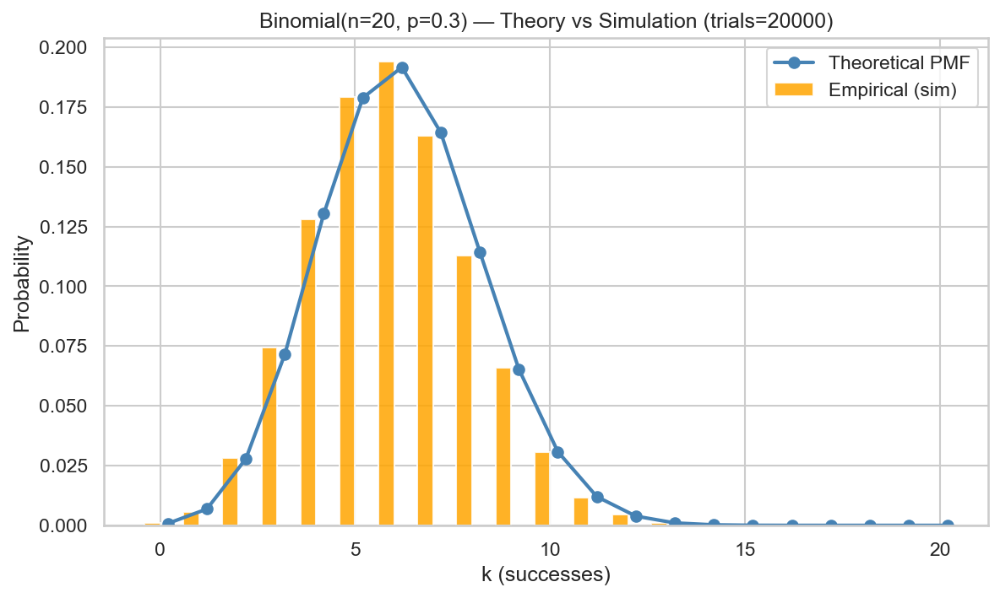
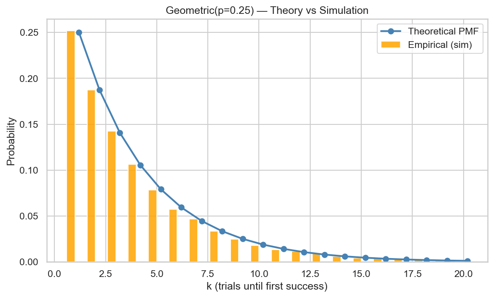
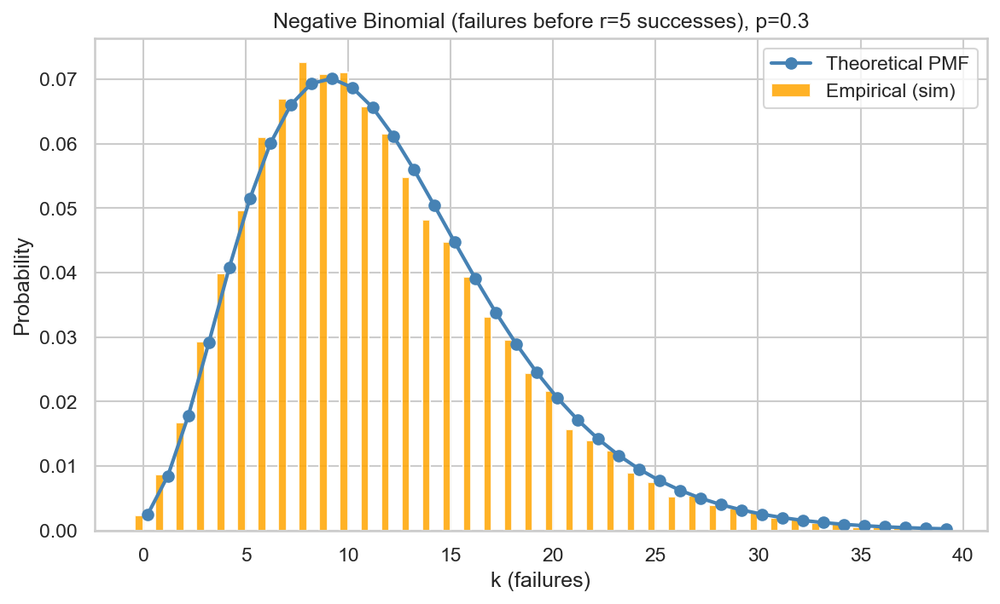
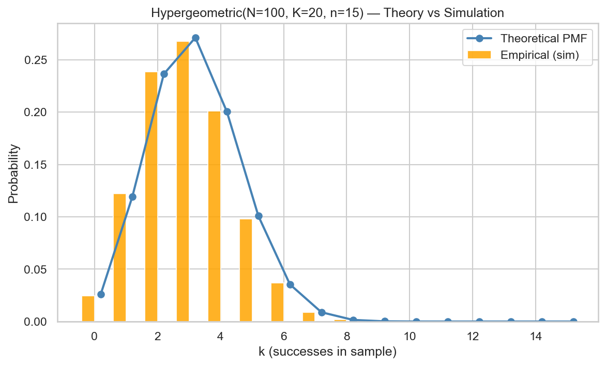
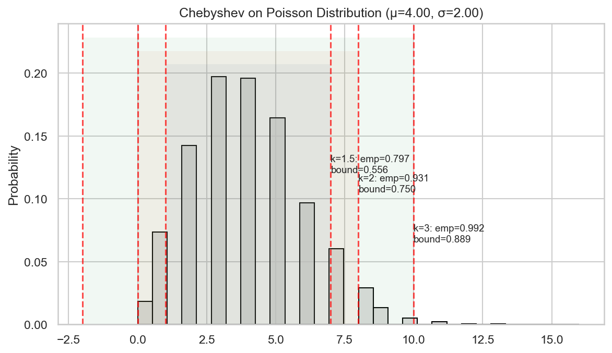

# 🎯 Discrete Distributions Explorer — Chapter 3  
*A part of the “Mastering Statistics in Python” series by Pranav Alok*


This project explores the world of **discrete probability distributions** through simulation and visualization.  
It combines theoretical formulas with Monte Carlo experiments to show how random processes behave in practice.  

This notebook covers:  
- **Binomial Distribution**  
- **Poisson Distribution**  
- **Geometric Distribution**  
- **Negative Binomial Distribution**  
- **Hypergeometric Distribution**  
- **Chebyshev’s Theorem Visualization**

---

## 🧠 Motivation  

This notebook is the **third chapter** in my *Mastering Statistics in Python* series.  
After learning descriptive and probability concepts, this chapter focuses on **discrete random variables** — the building blocks of all inferential statistics.

It demonstrates how theory (probability mass functions) connects with simulation (empirical frequencies).  
You’ll see how shape, mean, and variance change with parameters and understand *when* each distribution applies.

---

## ⚙️ Features  

✅ **Comprehensive Coverage of Discrete Distributions**  
- Binomial, Poisson, Geometric, Negative Binomial, and Hypergeometric  

✅ **Side-by-side Comparison**  
- Plots theoretical PMF vs simulated frequencies  
- Calculates empirical mean & variance and compares to theory  

✅ **Chebyshev’s Theorem Demonstration**  
- Visualizes how probabilities concentrate within multiples of σ  
- Works for non-normal distributions  

✅ **Clean, Self-Contained Notebook**  
- All plots render inline  
- Saves outputs to `/outputs` folder for GitHub preview  

✅ **Statistical Insight**  
- Includes parameter sensitivity experiments (varying p, λ, n)  
- Explains relationships between distributions (e.g., Binomial → Poisson limit)

---

## 🧩 Conceptual Overview  

### 📘 Binomial Distribution

**Probability Mass Function (PMF):**

$$
P(X = k) = \binom{n}{k} p^k (1 - p)^{n - k}, \quad k = 0, 1, \dots, n
$$

**Mean:** \( E[X] = np \)  
**Variance:** \( Var[X] = np(1 - p) \)  
**Typical Use Case:** Counting the number of successes in a fixed number of independent trials.

---

### 📘 Poisson Distribution

**PMF:**

$$
P(X = k) = e^{-\lambda} \frac{\lambda^k}{k!}, \quad k = 0, 1, 2, \dots
$$

$$
\quad E[X] = Var[X] = \lambda
$$  

**Typical Use Case:** Modeling rare event counts per unit time or space.

---

### 📘 Geometric Distribution

**PMF:**

$$
P(X = k) = (1 - p)^{k - 1} p, \quad k = 1, 2, 3, \dots
$$

$$
\quad E[X] = \frac{1}{p}, \quad Var[X] = \frac{1 - p}{p^2}
$$

**Typical Use Case:** Modeling the number of trials until the first success.

---

### 📘 Negative Binomial Distribution

**PMF:**

$$
P(X = k) = \binom{k - 1}{r - 1} p^r (1 - p)^{k - r}, \quad k = r, r+1, r+2, \dots
$$

$$
E[X] = \frac{r}{p}, \quad Var[X] = \frac{r(1 - p)}{p^2}
$$

**Typical Use Case:** Number of trials needed to achieve the r-th success.

---

### 📘 Hypergeometric Distribution

**PMF:**

$$
P(X = k) = \frac{\binom{K}{k} \binom{N - K}{n - k}}{\binom{N}{n}},
\quad \max(0, n - (N - K)) \le k \le \min(n, K)
$$

$$
E[X] = n\frac{K}{N}, \quad Var[X] = n\frac{K}{N}\left(1 - \frac{K}{N}\right)\frac{N - n}{N - 1}
$$

**Typical Use Case:** Sampling without replacement (e.g., number of successes in a sample of size \(n\)).


## 📈 Visual Outputs  

| Visualization | Description | Example |
|----------------|--------------|----------|
| **Binomial PMF** | Theory vs simulation for \(n=20, p=0.3\) |  |
| **Poisson PMF** | Counts of rare events (\(\lambda=4\)) |  |
| **Geometric PMF** | Waiting times until first success |  |
| **Negative Binomial PMF** | Failures before r successes |  |
| **Hypergeometric PMF** | Sampling without replacement |  |
| **Chebyshev Visualization** | Empirical vs theoretical bounds |  |

*(All figures are generated automatically in `/outputs/`.)*

---

## 🧮 Summary of Results  

| Distribution | Parameters | Empirical Mean | Theoretical Mean | Empirical Var | Theoretical Var |
|---------------|-------------|----------------|------------------|---------------|-----------------|
| Binomial | n=20, p=0.3 | ≈6.0 | 6.0 | ≈4.2 | 4.2 |
| Poisson | λ=4 | ≈4.0 | 4.0 | ≈4.0 | 4.0 |
| Geometric | p=0.25 | ≈4.0 | 4.0 | ≈12.0 | 12.0 |
| Neg. Binomial | r=5, p=0.3 | ≈16.5 | 16.7 | ≈38.0 | 38.9 |
| Hypergeometric | N=100, K=20, n=15 | ≈3.0 | 3.0 | ≈1.7 | 1.8 |

*(Values approximate; small differences due to simulation noise.)*

---

## 🧾 Chebyshev’s Theorem Illustration  

For any random variable with finite mean μ and standard deviation σ:  

$$
P(|X - \mu| < k\sigma) \ge 1 - \frac{1}{k^2}, \quad k > 1
$$

| k | Empirical (Geometric) | Bound \(1 - 1/k^2\) |
|---|------------------------|--------------------|
| 1.5 | 0.78 | 0.56 |
| 2.0 | 0.89 | 0.75 |
| 3.0 | 0.97 | 0.89 |

Chebyshev’s bound is conservative — actual probabilities exceed the guaranteed lower bound.

---

## 🧭 Learning Outcomes  

By completing this notebook, I have:  
✅ Linked **probability theory** with **simulation-based understanding**.  
✅ Learned how **distribution parameters** affect shape, mean, and variance.  
✅ Verified empirical results converge to theoretical values.  
✅ Understood relationships among discrete distributions.  
✅ Visualized **Chebyshev’s Theorem** empirically.  

---

## ⚙️ How to Run  

### 1️⃣ Clone Repository  
```bash
git clone https://github.com/<your-username>/discrete-distributions-explorer.git
cd discrete-distributions-explorer
```

### 2️⃣ Install Dependencies
```bash
pip install numpy pandas scipy matplotlib seaborn
```

### 3️⃣ Launch Jupyter Notebook
```bash
jupyter notebook Discrete_Distributions_Explorer.ipynb
```

## 🧩 Folder Structure
```
Chapter3_Discrete_Distributions_Explorer/
│
├── Discrete_Distributions_Explorer.ipynb
├── data/
│   └── (optional datasets)
├── outputs/
│   ├── binomial_pmf.png
│   ├── poisson_pmf.png
│   ├── geometric_pmf.png
│   ├── negative_binomial_failures_pmf.png
│   ├── hypergeometric_pmf.png
│   ├── chebyshev_poisson.png
│   └── discrete_distributions_summary.csv
└── README.md
```
## 📚 Part of the “Mastering Statistics in Python” Series
| Chapter | Project                                                                                          | Focus                                                           |
| ------- | ------------------------------------------------------------------------------------------------ | --------------------------------------------------------------- |
| ✅ 1     | [Descriptive Statistics Analyzer](https://github.com/Pranav-Alok/descriptive-statistics-analyzer) | Summarizing and visualizing datasets                          |
| ✅ 2     | [Probability Simulator](https://github.com/Pranav-Alok/probability-simulator)                     | Random experiments & conditional probability                  |
| ✅ 3    | **Discrete Distributions Explorer**                                                              | Binomial, Poisson, Geometric, Negative Binomial, Hypergeometric |
| 🔜 4    | Continuous Distributions Visualizer                                                              | Normal, Exponential, Gamma distributions                        |

## 🧮 Future Dashboard Integration

This notebook will later form a module in the upcoming Interactive Statistics Dashboard built with Streamlit, 
combining Chapters 1–4 into a unified educational tool for exploring statistical concepts interactively.

# 🪶 Author
**Pranav Alok**
B.Sc. Analytics & Sustainability Studies, TISS Mumbai
🎯 Focus: Data Analytics | Probability | Environmental Statistics
🌐 [LinkedIn](https://www.linkedin.com/in/pranav-alok-aa0664338/)| [GitHub](https://github.com/Pranav-Alok)

## 🧾 License
This project is licensed under the MIT License — you are free to use, modify, and share with attribution.

## Acknowledgement
Built as part of my Mastering Statistics journey — combining mathematical foundations, Python simulation, and sustainability applications.
> “Understanding distributions means understanding uncertainty — the most beautiful part of data.”

